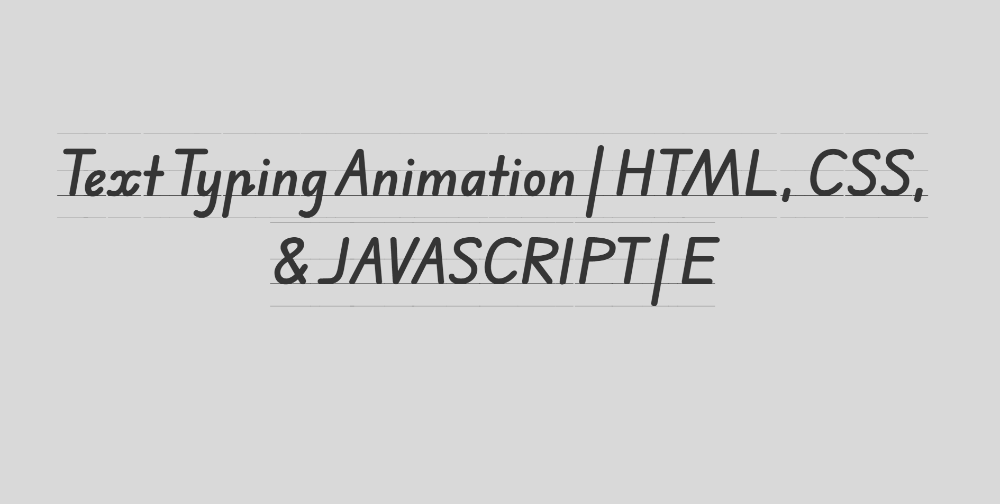

<h1 align="center">TEXT TYPING ANIMATION</h1>
<h3 align="center">TEXT TYPING ANIMATION | HTML, CSS, & JAVASCRIPT</h3>

<p align="center">
  <a href="#-about-the-project">About the project</a>&nbsp;&nbsp;&nbsp;|&nbsp;&nbsp;&nbsp;
  <a href="#-getting-started">Getting started</a>&nbsp;&nbsp;&nbsp;|&nbsp;&nbsp;&nbsp;
  <a href="#%EF%B8%8F-technologies-used">Technologies Used</a>&nbsp;&nbsp;&nbsp;|&nbsp;&nbsp;&nbsp;
  <a href="#-video-youtube">Video Youtube</a>&nbsp;&nbsp;&nbsp;|&nbsp;&nbsp;&nbsp;
  <a href="#-how-to-contribute">How to contribute</a>&nbsp;&nbsp;&nbsp;|&nbsp;&nbsp;&nbsp;
  <a href="#-license">License</a>
</p>

---

<p align="center">
  
</p>

---
## 💡 About the project
TEXT TYPING ANIMATION
- [Demo](https://elzunayr.github.io/text-typing-animation/)

## 🚀 Getting started

If you installed git you can clone the code to your machine, or download a ZIP of all the files directly.
[Download the ZIP from this location](https://github.com/ElZunayr/text-typing-animation.git), or run the following [git](https://git-scm.com/downloads) command to clone the files to your machine:
```bash
git clone https://github.com/ElZunayr/text-typing-animation.git
```
- Once the files are on your machine, open the _linktree_ folder in [Visual Studio Code](https://code.visualstudio.com/).
- With the files open in Visual Studio Code, press the **Go Live** button at the bottom of the window to launch the files with [Live Server](https://marketplace.visualstudio.com/items?itemName=ritwickdey.LiveServer).
- Change the profile image and texts in the `index.html` file.

## 🖥️ Technologies Used
+ HTML
+ CSS
+ JAVASCRIPT

## 🤔 How to contribute

- Fork this repository;
- Create a branch with your feature: `git checkout -b my-feature`;
- Commit your changes: `git commit -m "feat: my new feature"`;
- Push to your branch: `git push origin my-feature`.

Once your pull request has been merged, you can delete your branch.

## 🧰 Video Youtube
[](https://youtu.be/JxzyVG-fVVw)

## 📝 License

This project is under the MIT license. See the [LICENSE](LICENSE) file for more details.

---

Made with by EL Zunayr Development 

---
Support El Zunayr :wave: [Get in touch](buymeacoffee.com/elzunayr)

## 🔗 References
- https://youtu.be/ZPIhPPK4OMo?si=UIvJrXlkl_WbUPrj
